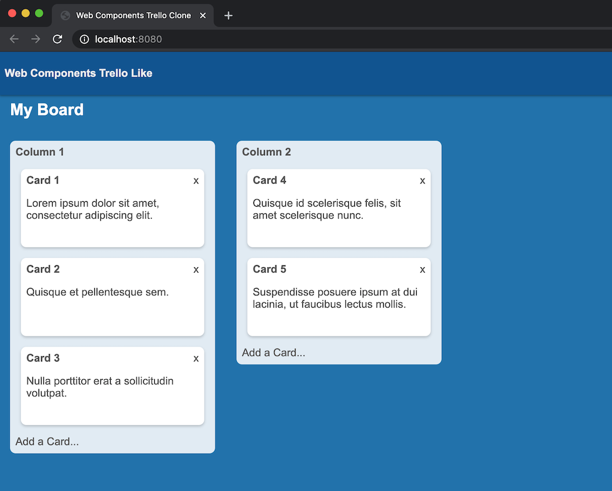

# Web components trello clone
    A trello clone using web components

## Install
```bash 
    npm install
    npm start
```



## Test
```bash
    npm run test
```

## Testing Strategy

- Expect visibility of elements based on given state.
- Expect an elements class when an event is triggered.
- Write test cases to cover lines.
- Test components independently

## Technologies

- Vanilla JS